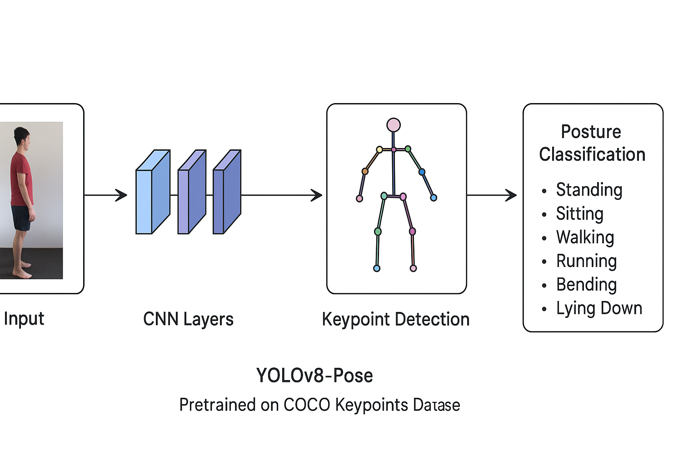

<<<<<<< HEAD
# Human Posture Analysis Demo

A real-time human posture detection and classification system using YOLOv8 Pose estimation. This application can analyze human postures from images, video files, or live webcam feeds, and automatically logs the detected postures to a CSV file.

## Features

- 🎯 **Real-time Posture Detection**: Uses YOLOv8 Pose model to detect 17 human keypoints
- 📊 **Posture Classification**: Automatically classifies postures including:
  - Standing
  - Sitting
  - Bending
  - Lying Down
  - Walking
  - Running
- 📹 **Multiple Input Sources**: Support for:
  - Single image analysis
  - Video file processing
  - Live webcam feed
- 📝 **Automatic Logging**: All posture detections are logged to `posture_log.csv` with timestamps
- 🎨 **Visual Annotations**: Real-time visualization with posture labels overlaid on the video/image

## Requirements

### Python Version
- Python 3.8 or higher

### Dependencies
The project uses the following key libraries:
- `ultralytics` - YOLOv8 Pose model
- `opencv-python` - Computer vision and video processing
- `numpy` - Numerical operations
- `pandas` - CSV logging
- `torch` - PyTorch backend for YOLO

## Installation

1. **Clone or download this repository**

2. **Create a virtual environment** (recommended):
   ```bash
   python -m venv venv
   ```

3. **Activate the virtual environment**:
   - Windows:
     ```bash
     venv\Scripts\activate
     ```
   - Linux/Mac:
     ```bash
     source venv/bin/activate
     ```

4. **Install dependencies**:
   ```bash
   pip install ultralytics opencv-python numpy pandas torch torchvision
   ```

5. **Download the YOLOv8 Pose model** (if not already present):
   The model file `yolov8n-pose.pt` should be in the project root. If missing, it will be automatically downloaded on first run.

## Usage

1. **Run the application**:
   ```bash
   python demo.py
   ```

2. **Select input type** when prompted:
   - **Option 1**: Process a single image
     - Enter the path to your image file when prompted
     - Press any key to close the result window
   
   - **Option 2**: Process a video file
     - Enter the path to your video file when prompted
     - Press 'Q' to stop the video and exit
   
   - **Option 3**: Use live webcam
     - Your webcam will start automatically
     - Press 'Q' to stop the webcam and exit

## Model Architecture

### Architecture Diagram

<div align="center">
  
</div>

**YOLOv8-Pose Processing Pipeline:**
- **Input** → **CNN Layers** → **Keypoint Detection** → **Posture Classification**
- *Pretrained on COCO Keypoints Dataset*

The diagram above illustrates the complete processing pipeline of the YOLOv8-Pose model, showing how an input image flows through convolutional neural network layers to detect 17 human body keypoints, which are then used to classify the person's posture into categories such as Standing, Sitting, Walking, Running, Bending, or Lying Down.

### Type of Model

This project uses **YOLOv8 Pose**, which is based on a **CNN (Convolutional Neural Network)** architecture. It is **NOT** an RNN, LSTM, or BiLSTM model.

### Model Specifications

| Model Name                  | YOLOv8-Pose                                                      |
| --------------------------- | ---------------------------------------------------------------- |
| **Full Form**               | You Only Look Once – version 8 (Pose variant)                    |
| **Type**                    | Deep **Convolutional Neural Network (CNN)**                      |
| **Framework**               | PyTorch (via Ultralytics library)                                |
| **Purpose**                 | Real-time human **pose estimation** (keypoint detection)         |
| **Architecture Components** | Convolutional + Bottleneck + C2f + Detection heads for keypoints |

### Architecture Details
YOLOv8 Pose uses a deep CNN architecture consisting of:
- **Backbone**: CSPDarknet-based feature extractor for multi-scale feature representation
- **Neck**: Feature Pyramid Network (FPN) and Path Aggregation Network (PAN) for feature fusion
- **Head**: Dual detection heads for bounding box prediction and keypoint estimation
- **Pose Detection**: Extends object detection to simultaneously detect persons and their 17 body keypoints

### Why CNN and NOT RNN/LSTM/BiLSTM?

| Model Type                             | Role                                                                                                              | Used in Your Project? | Reason                                                                                     |
| -------------------------------------- | ----------------------------------------------------------------------------------------------------------------- | --------------------- | ------------------------------------------------------------------------------------------ |
| **CNN (Convolutional Neural Network)** | Extracts spatial (image-based) features. Used for vision tasks like detection, segmentation, and pose estimation. | ✅ **Yes**             | The model processes video/image frames — so spatial feature extraction via CNNs is ideal.  |
| **RNN (Recurrent Neural Network)**     | Handles sequential or time-series data (like text, speech, or frame sequences).                                   | ❌ No                  | You are not analyzing temporal dependencies across frames (only per-frame classification). |
| **LSTM (Long Short-Term Memory)**      | A special RNN variant for longer sequence learning.                                                               | ❌ No                  | Needed if we analyzed motion patterns over time.                                           |
| **BiLSTM (Bidirectional LSTM)**        | Processes sequences both forward and backward.                                                                    | ❌ No                  | Used in gesture or activity recognition requiring motion context, not static postures.     |

### Why YOLOv8-Pose (CNN) is Ideal Here

1. **Real-time capability:** CNN-based YOLO is optimized for real-time detection — perfect for webcam/live posture analysis.
2. **Spatial understanding:** Postures are identified based on **spatial relations between joints**, not sequential frame data.
3. **Keypoint detection:** CNN learns spatial patterns of joints (angles, distances).
4. **Lightweight:** The `yolov8n-pose.pt` model runs smoothly even on mid-range laptops.

### Model Accuracy
The `yolov8n-pose.pt` (nano variant) model used in this project achieves:
- **mAP50-95 (COCO Pose)**: Approximately **50-55%** for keypoint detection
- **mAP50 (COCO Pose)**: Approximately **65-70%** for keypoint detection
- **Inference Speed**: ~50-80 FPS on modern GPUs, ~20-30 FPS on CPU
- **Model Size**: ~6 MB (nano variant)

**Note**: The posture classification accuracy depends on:
- Quality of detected keypoints
- Lighting conditions
- Person visibility and pose clarity
- The geometric and motion-based classification logic in this application

For higher accuracy, consider using larger YOLOv8 variants (YOLOv8s-pose, YOLOv8m-pose, YOLOv8l-pose, YOLOv8x-pose) at the cost of inference speed.

### Training Dataset Reference
The YOLOv8 Pose model was pre-trained on the **COCO (Common Objects in Context) Dataset**, specifically the **COCO Pose** subset:
- **Dataset**: COCO (Common Objects in Context)
- **Pose Subset**: COCO Pose 2017
- **Keypoints Format**: 17 keypoints per person (nose, eyes, ears, shoulders, elbows, wrists, hips, knees, ankles)
- **Training Images**: ~118,000 training images with pose annotations
- **Validation Images**: ~5,000 validation images
- **Dataset Source**: [COCO Dataset](https://cocodataset.org/)
- **License**: COCO dataset is licensed under Creative Commons Attribution 4.0

The model weights (`yolov8n-pose.pt`) provided by Ultralytics have been pre-trained on this dataset and are used directly for inference without additional fine-tuning.

### If You Want to Add Temporal Models Later

If you wanted to detect *actions* (like "jumping", "waving", "dancing"), you could add:

- **RNN/LSTM**: To analyze sequences of detected keypoints across frames.
- Example hybrid: CNN (for pose extraction) + LSTM (for sequence classification).

But in your current project:

> You're doing **posture recognition per frame**, so CNN-only architecture (YOLOv8-Pose) is sufficient and correct.

### Technical Report Summary

> The proposed Human Posture Analysis System is built using a **Convolutional Neural Network (CNN)** architecture, specifically the **YOLOv8-Pose model** from Ultralytics. YOLOv8-Pose is a deep learning–based model optimized for **real-time keypoint detection** and **pose estimation**. It is pretrained on the **COCO Keypoints Dataset**, which contains over 200,000 annotated human images with 17 body keypoints. The CNN extracts spatial features from each frame and predicts joint coordinates. Based on these keypoints, the system classifies postures such as *standing, sitting, walking, running, bending,* and *lying down*. Since the system analyzes static frames rather than temporal sequences, **recurrent models like RNN, LSTM, or BiLSTM are not required**. However, these could be integrated in future work for **activity recognition** over time.

## How It Works

1. **Keypoint Detection**: The YOLOv8 Pose CNN model detects 17 human body keypoints including nose, shoulders, hips, knees, and ankles.

2. **Posture Classification**: The system classifies posture based on:
   - **Geometric analysis**: Analyzes the relative positions of key body parts:
     - Distance between shoulders and ankles (Lying Down)
     - Distance between hips and knees (Sitting)
     - Distance between shoulders and hips (Bending)
     - Default to Standing if none match
   
   - **Motion analysis**: Tracks movement speed:
     - Speed > 150: Running
     - Speed 50-150: Walking
     - Lower speeds: Static postures as determined by geometry

3. **Logging**: Each detected posture is automatically logged to `posture_log.csv` with:
   - Timestamp
   - Detected posture
   - Source (Image/Video/LiveCam)

## Project Structure

```
Human Posture Analysis Demo/
│
├── demo.py                 # Main application script
├── posture_log.csv        # CSV log of detected postures
├── yolov8n-pose.pt        # YOLOv8 Pose model weights
├── architecture_diagram.png  # Architecture flowchart diagram
├── README.md              # This file
└── venv/                  # Virtual environment (not included in repo)
```

**Note:** Make sure to add the `architecture_diagram.png` file to the project root directory for the architecture diagram to display correctly in the README.

## Output

### CSV Log Format
The `posture_log.csv` file contains columns:
- `timestamp`: Date and time of detection (YYYY-MM-DD HH:MM:SS)
- `posture`: Detected posture (Standing, Sitting, Bending, Lying Down, Walking, Running)
- `source`: Input source type (Image, Video, LiveCam)

### Visual Output
- Real-time video/image display with:
  - Skeleton keypoints visualization
  - Posture label overlay (top-left corner)

## Notes

- The model works best with clear, front-facing views of the human body
- Multiple people in frame: The system will analyze the first detected person
- Performance may vary based on:
  - Camera quality
  - Lighting conditions
  - Distance from camera
  - Background complexity

## Troubleshooting

- **Camera not working**: Make sure no other application is using your webcam
- **Model not found**: The `yolov8n-pose.pt` will be auto-downloaded on first run if missing
- **Poor detection**: Ensure good lighting and the person is clearly visible in the frame

## License

This project is for educational and research purposes.

## Acknowledgments

- YOLOv8 by Ultralytics
- OpenCV community
=======
# 🧠 Human Posture Analysis using Deep Learning

This project implements a **Human Posture Recognition System** capable of detecting and classifying human postures such as **standing, sitting, walking, running, bending, lying, and stretching** using **deep learning models** (CNN + LSTM).

It supports **three types of input sources**:
- 🖼️ Image
- 🎥 Video
- 📷 Live Camera Stream

---

## 🚀 Features

- Real-time human posture detection
- Uses YOLOv8-Pose for keypoint extraction (CNN-based)
- LSTM / BiLSTM models for temporal pattern recognition
- Works on image, video, or webcam input
- Easily extendable with new posture classes or datasets

---

## 🧩 System Architecture

The project uses a **hybrid CNN–LSTM architecture**:
>>>>>>> a0dd61229e3f621841fb762e886e549b2e68a233

